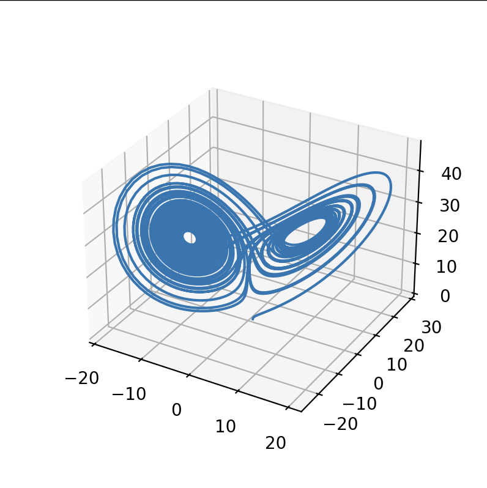

# ODEZig

Ordinary differential equation solving in pure Zig and almost entirely on the stack! Tiny weekend project, will probably not be actively maintained.

## Usage

```zig
const std = @import("std");
const odezig = @import("odezig");

// define problem
fn lorenz(du: *[3]f64, u: *const [3]f64, _: f64, p: *LorenzParams) void {
    du[0] = p.sigma * (u[1] - u[0]);
    du[1] = u[0] * (28.0 - u[2]) - u[1];
    du[2] = u[0] * u[1] - (p.beta) * u[2];
}

// problem parameters
const LorenzParams = struct{
    sigma: f64 = 10.0,
    beta: f64 = 8.0 / 3.0
};

var gpa = std.heap.GeneralPurposeAllocator(.{}){};

pub fn main() !void {
    defer _ = gpa.deinit();
    // need to tell the solver the datatype and length of array
    // so that everything can be stack allocated
    var prob = odezig.Tsit5(f64, 3, LorenzParams).init(lorenz, .{});

    // get common solver interface
    var solver = prob.getSolver(gpa.allocator());

    const u: [3]f64 = .{1.0, 0.0, 0.0};
    var sol = try solver.solve(
        u, 0.0, 100.0, .{.save = true, .dt = 1e-5, .max_iters = 10_000}
    );
    defer sol.deinit();

    // print solution overview to stdout
    const stdout = std.io.getStdIn();
    try sol.printInfo(stdout);

    // then write it to a file and plot it with your plotting package of choice
} 
```



## Solvers

Currently implemented is only the basic fixed step-size Newton method, and Tsitouras 5/4 Runge Kutta.

## Plan

The scope of this project is just so I can write a quick weekend relativistic ray tracer in Zig, and so the plan is extremely limited:

- [x] Callback functions
- [ ] Adaptive step size algorithms
- [ ] Serialise and export solution to known format
- [ ] Multi-threaded solving
- [ ] (stretch) Interpolations

## Citations
 
This work is heavily inspired by the Julia [DifferentialEquations.jl](https://github.com/SciML/DifferentialEquations.jl) library and SciML ecosystem. The Tsitouras 5/4 coefficients are taken directly from their implementation.
